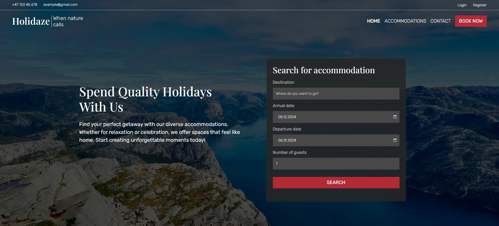

Holidaze | Project Exam 2



Live site <https://thbergseng-holidaze.netlify.app/>

## Description

My second and final project exam where the task is to produce a booking site for accommodation called Holidaze. The task shall showcase everything I have learned during the studies.
The page allows users to register as a customer for renting venues, or as a venue manager who can also post and rent out venues to other users. The page should have a 
booking calendar, venues list, possibility of searching venues, single venue page, profile page, the possibility to see a list of upcoming bookings as well as managed venues for the venue managers. Venue managers may
update their managed venues. There should also be a contact form. Users can log in and log out, and update their profile with an avatar. 


The booking site consists of the following pages

- Homepage with a search form
- Venues list which also includes a search form
- Single venues page with a calendar for booking
- Contact page
- Registration page
- Login page
- Profile page with upcoming and managed bookings (for venue managers)
- age for updating profile

## Built With

You can list a the tech stack that you've used over here

- Vite
- React
- Bootstrap
- React Bootstrap
- Redux (implemented at certain places for training purposes)

## Getting Started

### Installing

This is where you list how to get the project started. It typically just includes telling a person to clone the repo and then to install the dependencies e.g.

1. Clone the repo:
    ```bash
    git clone [https://github.com/teehbee/project-exam-2]
    ```
    ```
    cd <your-project-folder>
    ```
2. Install dependencies
    ```bash
    npm install
    ```
3. Set up environmental variables

    Create an .env file in your root directory and enter the Noroff api base url and API key
    ```bash
    VITE_BASE_URL="base-url-key"
    VITE_API_KEY="api-key"
    ```
4. Run application
    ```bash
    npm run dev
    ```

The application shall now run locally on your system

## Contributions

If you encounter any bugs or errors while using the application, feel free to contact me. Your feedback is greatly appreciated and will help improve the project.

## Contact

[My LinkedIn page](www.linkedin.com/in/tor-håkon-bergseng-981408250)

[My e-mail address](thbergseng@gmail.com)
